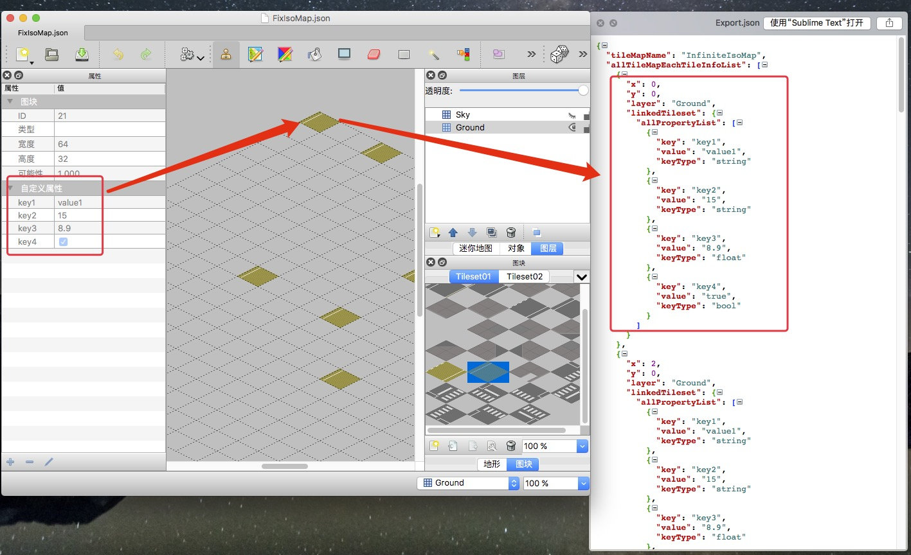
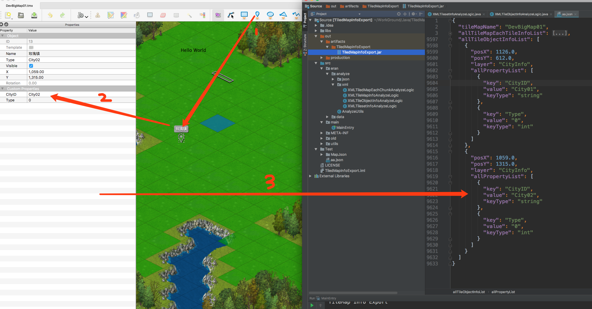

# TiledMapInfoExport

**注意! 图片中的Json导出结构和最终的结构有区别**




## Update

### 18-06-17

- 增加`tmx`格式中的ObjectGroup层级导出 (`注意`: Json格式的地图文件暂不支持)

### 18-04-04

- 修改`Json`的导出格式去除`linkedTileset`层级

### 18-03-27

- 增加对`tmx`格式的地图以及`tsx`格式的Tileset支持

## 工具的用途

将Tiled中的瓦片自定义信息和当前地图信息 一起导出为一份`Json`文件. 方便其他工具读取对应的自定义属性

## 使用方法

```
java -jar TilemapInfoExport.jar **TileMapPath** **ExportPath**

like:

java -jar TilemapInfoExport.jar C:\tilemap01.tmx E:\out\output.json

```


---

## Overview

TiledMapInfoExport is a simple java command line tool that can help you to export Tiled map file (`TMX` or `Json`) to a json file.

- ObjectGroup layer support.


## How to use

```
java -jar TilemapInfoExport.jar **TileMapPath** **ExportPath**

like:

java -jar TilemapInfoExport.jar C:\tilemap01.tmx E:\out\output.json

```


